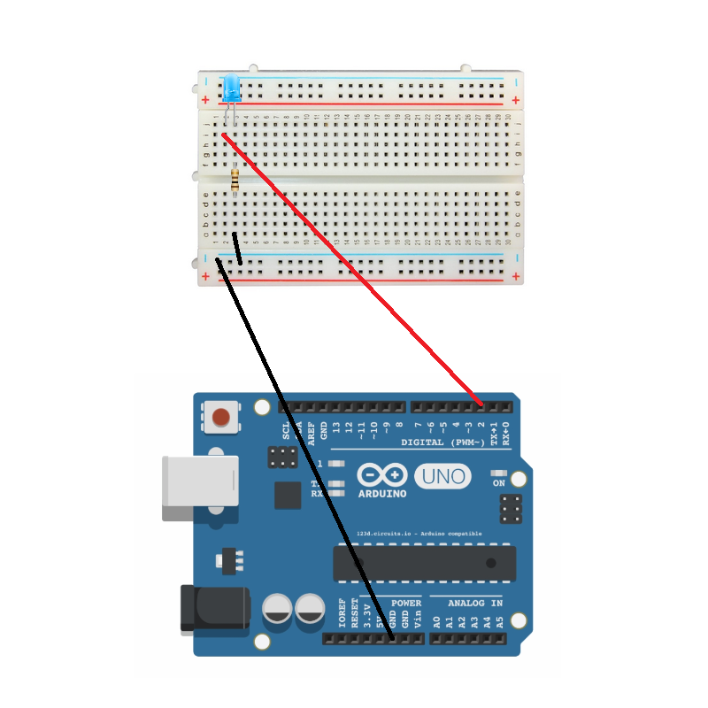

# Requiremenst
  - Arduino board
  - USB Cable
  - Breedboard
  - LED 
  - 220Ω Resistor
  - Wires
  
**For each LED you need one resistor (1 LED = 1 Resistor)**

# How to connect
This "scheme/image" can be used for any .py script in it's folder
If you have more leds, just do same process starting from pin 3

# Notes
 - LED has polarity ("+" and "-"), wrongly connected they will not work.
 - LED "+" has longer leg, LED "-" has shorter
 - Resistors doesn't have polarity ("+" or "-"), no matter how you connect them results will be same.

# First step first
I consider that you already installed driver and prepared your board
1. Download [ArduinoIDE](https://www.arduino.cc/en/software) 
2. Select right port and board (Tools -> Board, Port)
3. Go to File -> Examples -> Firmata -> StandardFirmata -> Upload (Arrow)
4. Configure config.json file for your needs, the most important is to select right USB port
5. Run .py code
